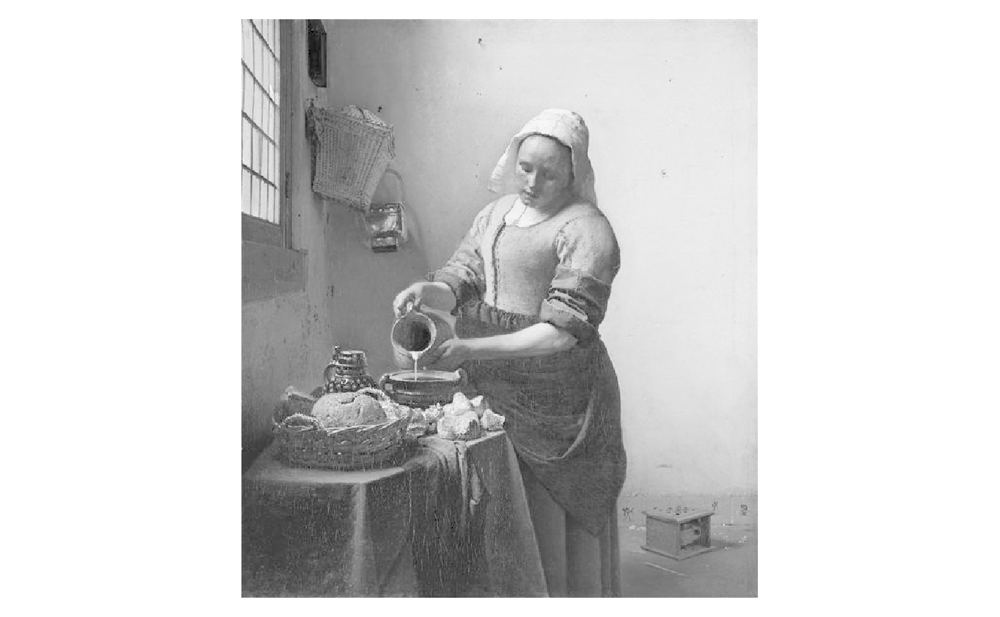
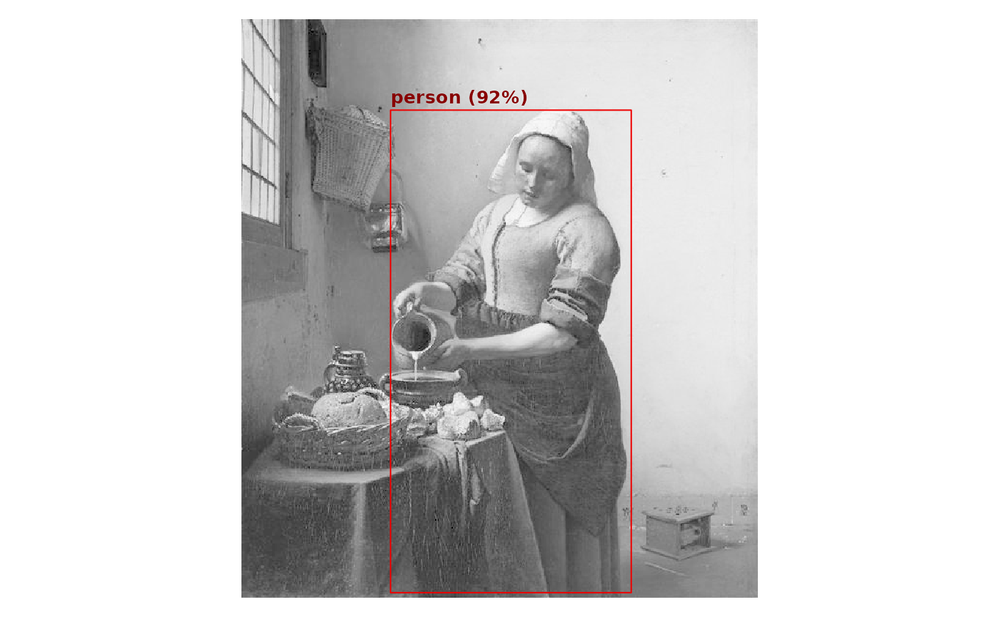

# End-to-end example

To demonstrate the package in a more realistic setting, we’ll show how
to run an image detection network. First, we’ll download the YOLO26 (You
Only Look Once) pretrained model from the Ultralytics repository.

``` r

model_url = "https://github.com/ultralytics/assets/releases/download/v8.4.0/yolo26n-pose.onnx"
model_path = file.path(tempdir(), "yolo26n.onnx")
download.file(model_url, model_path, mode = "wb")
```

Then we can load the package and load the model.

``` r

library(onnxr)

model = onnx_model(model_path)
print(model)
#> onnxr model
#>   model:   /tmp/RtmppFKphN/yolo26n.onnx 
#>   provider: cpu  threads: 1 
#>   input:  images [1, 3, 640, 640] <float>
#>   output: output0 [1, 300, 57] <float>
```

We can see that the model takes in a single 640x640 RGB image stored as
a 4-dimensional array. The [model
documentation](https://docs.ultralytics.com/guides/end2end-detection)
explains that the output is a set of 300 bounding boxes, each with 6
values: the coordinates of the box (x1, y1, x2, y2), the confidence
score, and the class index. We can store the object types in a vector
for later use.

``` r

types = c(
    "person", "bicycle", "car", "motorcycle", "airplane", "bus", "train", 
    "truck", "boat", "traffic light", "fire hydrant", "stop sign", 
    "parking meter", "bench", "bird", "cat", "dog", "horse", "sheep", "cow", 
    "elephant", "bear", "zebra", "giraffe", "backpack", "umbrella", "handbag", 
    "tie", "suitcase", "frisbee", "skis", "snowboard", "sports ball", "kite", 
    "baseball bat", "baseball glove", "skateboard", "surfboard", "tennis racket", 
    "bottle", "wine glass", "cup", "fork", "knife", "spoon", "bowl", "banana", 
    "apple", "sandwich", "orange", "broccoli", "carrot", "hot dog", "pizza", 
    "donut", "cake", "chair", "couch", "potted plant", "bed", "dining table", 
    "toilet", "tv", "laptop", "mouse", "remote", "keyboard", "cell phone", 
    "microwave", "oven", "toaster", "sink", "refrigerator", "book", "clock", 
    "vase", "scissors", "teddy bear", "hair drier", "toothbrush"
)
```

Now we are ready to load an image (Vermeer’s [*The
Milkmaid*](https://en.wikipedia.org/wiki/The_Milkmaid_(Vermeer))) and
run the model on it.

``` r

# load image from URL and center in 640x640 array
img_url = "https://uploads0.wikiart.org/images/johannes-vermeer/the-milkmaid.jpg!Large.jpg"
img = array(1, dim = model$input_shapes$images)
con = url(img_url, "rb")
raw = jpeg::readJPEG(readBin(con, "raw", n = 5e4))
close(con)
img[1, 1:3, 21:620, 53:587] = aperm(raw, c(3, 1, 2))

# helper to plot image
plot.image <- function(x) {
    par(mar = c(0, 0, 0, 0))
    rev_y = rev(1:dim(x)[3])
    x = 0.299 * x[1, 1, , ] + 0.587 * x[1, 2, , ] + 0.114 * x[1, 3, , ]
    image(
        t(x[rev_y, ]),
        col = gray.colors(256, start = 0, end = 1),
        asp = nrow(x) / ncol(x),
        axes = FALSE
    )
}
plot.image(img)
```



To run the model, we simply call
[`onnx_run()`](http://corymccartan.com/onnxr/reference/onnx_run.md) with
the session and the input image. The `simplify = TRUE` argument tells
the function to return the single output array directly, instead of a
named list. We see that the output contains bounding box coordinates,
confidence scores, and object type indices, as expected.

``` r

res = onnx_run(model, img, simplify = TRUE)
dim(res)
#> [1]   1 300  57
head(res[1, ,])
#>              [,1]      [,2]      [,3]     [,4]         [,5] [,6]      [,7]
#> [1,] 206.42146301 113.90990 456.16391 615.1938 0.9176854491    0 353.47113
#> [2,] 209.49263000 113.62814 444.77728 375.8095 0.0036238432    0 351.60300
#> [3,] 207.19599915 114.06410 449.48398 443.2114 0.0028128326    0 351.87845
#> [4,]  -0.10976219  63.14240  53.52866 623.0917 0.0024071336    0  38.48569
#> [5,]  -0.10278511  35.33160  54.56547 619.0152 0.0010030270    0  37.53345
#> [6,]  -0.09935951 -38.08398  52.94409 520.2239 0.0007559657    0  39.47545
#>           [,8]        [,9]     [,10]      [,11]       [,12]     [,13]
#> [1,] 190.22043 0.996435881 367.87338 178.988464 0.999253213 346.03568
#> [2,] 190.92609 0.992491603 367.06915 178.937668 0.994844556 344.33447
#> [3,] 190.81532 0.995041013 367.33279 178.950287 0.997358322 344.44641
#> [4,] 185.78070 0.003808498  35.07178 170.562683 0.008305043  36.93970
#> [5,] 152.54466 0.006096065  36.09745 136.793945 0.009024441  35.76754
#> [6,]  25.41473 0.049429655  44.15492   8.203293 0.044528097  35.00936
#>           [,14]       [,15]     [,16]     [,17]      [,18]     [,19]     [,20]
#> [1,] 175.303101 0.984456062 396.91931 172.63254 0.98695946 338.79425 163.76508
#> [2,] 175.064438 0.960005641 397.18484 173.87216 0.93202823 337.60742 164.14932
#> [3,] 175.281845 0.966884971 397.69406 173.22154 0.95943666 337.13760 164.21783
#> [4,] 168.036560 0.004653364  33.49520 185.48170 0.02081677  32.59158 182.72263
#> [5,] 133.999420 0.005879521  36.16358 150.95502 0.02193043  31.41484 147.34468
#> [6,]   4.514252 0.020435184  45.56270  20.74503 0.05283198  25.60762  13.60054
#>            [,21]     [,22]    [,23]      [,24]     [,25]    [,26]       [,27]
#> [1,] 0.272263587 412.07700 241.4863 0.99716479 321.24673 220.2660 0.997757614
#> [2,] 0.173134863 409.94952 240.5609 0.99152684 314.23438 220.1378 0.995615065
#> [3,] 0.121075422 411.11896 240.4816 0.99476767 315.67377 220.7189 0.996750712
#> [4,] 0.007521898  35.37288 324.3905 0.06097558  25.34603 304.8704 0.005645841
#> [5,] 0.008798838  36.50075 289.2749 0.07641020  24.45101 268.6796 0.007650644
#> [6,] 0.014509112  38.93666 140.3916 0.18344113  22.49281 131.8306 0.008966178
#>          [,28]    [,29]      [,30]     [,31]    [,32]       [,33]      [,34]
#> [1,] 385.24472 342.2337 0.99801564 284.89032 290.5231 0.991106689 292.516968
#> [2,] 394.49719 334.7492 0.96980828 279.29034 281.5217 0.990018308 304.390656
#> [3,] 390.86755 340.8039 0.99006569 281.72324 281.5415 0.994420528 296.084198
#> [4,]  18.58207 444.1888 0.04871798  19.22853 410.9872 0.002438784   2.047668
#> [5,]  18.42757 410.7917 0.06380156  19.57654 367.4442 0.003326416   1.784338
#> [6,]  35.60227 221.5210 0.13644427  20.52913 223.7853 0.006011337  21.617609
#>         [,35]      [,36]     [,37]    [,38]       [,39]     [,40]    [,41]
#> [1,] 361.0380 0.99516445 250.67032 304.5031 0.977032363 390.90851 403.0840
#> [2,] 356.5866 0.96324074 249.72452 303.3703 0.992164373 375.07648 397.3235
#> [3,] 362.9267 0.98488849 248.61026 302.9835 0.995870590 381.70081 403.4591
#> [4,] 431.1575 0.03087389  16.82401 397.7217 0.006729037  20.49390 547.1776
#> [5,] 389.7267 0.03948879  14.34794 332.3745 0.007712066  19.06559 531.8156
#> [6,] 143.9107 0.07250962  15.44111 122.1900 0.024947613  23.87258 384.1523
#>            [,42]      [,43]    [,44]       [,45]     [,46]    [,47]       [,48]
#> [1,] 0.993038774 330.250824 395.3286 0.993954897 403.99057 535.6999 0.966722369
#> [2,] 0.960251033 312.747009 384.9297 0.975985289 369.11075 472.9950 0.343837410
#> [3,] 0.985804200 319.879517 392.8659 0.990967393 387.13776 503.1779 0.535593808
#> [4,] 0.006371349  12.165071 539.0492 0.001729757  23.67530 521.3142 0.006109327
#> [5,] 0.007043928   9.860837 523.2758 0.002078623  21.26644 512.2722 0.005301684
#> [6,] 0.005799890   9.736877 378.5787 0.001451999  30.75555 331.1863 0.004767329
#>          [,49]    [,50]       [,51]     [,52]    [,53]       [,54]      [,55]
#> [1,] 365.22345 523.3089 0.965280414 405.89056 619.9973 0.200906575 381.215393
#> [2,] 323.02283 464.2714 0.421992600 354.54553 512.7134 0.027370840 333.870972
#> [3,] 348.24310 495.4066 0.598703742 380.79868 558.6984 0.040690154 369.102051
#> [4,]  23.08893 515.4579 0.003447145  20.45478 524.2849 0.003492683  17.157000
#> [5,]  19.42646 507.2020 0.002810150  17.93322 515.8429 0.002709299  14.082227
#> [6,]  22.77301 330.2110 0.001826465  17.67466 325.1767 0.002233446   8.524797
#>         [,56]        [,57]
#> [1,] 602.4675 0.2685425282
#> [2,] 501.3198 0.0290561318
#> [3,] 546.0801 0.0461526215
#> [4,] 519.4102 0.0022049248
#> [5,] 509.6618 0.0016226470
#> [6,] 321.3218 0.0006300807
```

Finally, we can pull out the bounding boxes with confidence scores above
a certain threshold and plot them on top of the image.

``` r

plot.image(img)
idx_conf = which(res[1, , 5] >= 0.2)
for (j in idx_conf) {
    x1 = res[1, j, 1] / 640
    y1 = 1 - res[1, j, 2] / 640
    x2 = res[1, j, 3] / 640
    y2 = 1 - res[1, j, 4] / 640
    rect(x1, y1, x2, y2, border = "#e00", lwd = 1)
    lbl = paste0(types[res[1, j, 6] + 1], " (", round(res[1, j, 5] * 100), "%)")
    text(x1, y1, lbl, adj = c(0, -0.5), cex = 0.8, col = "#800", font = 2)
}
```


